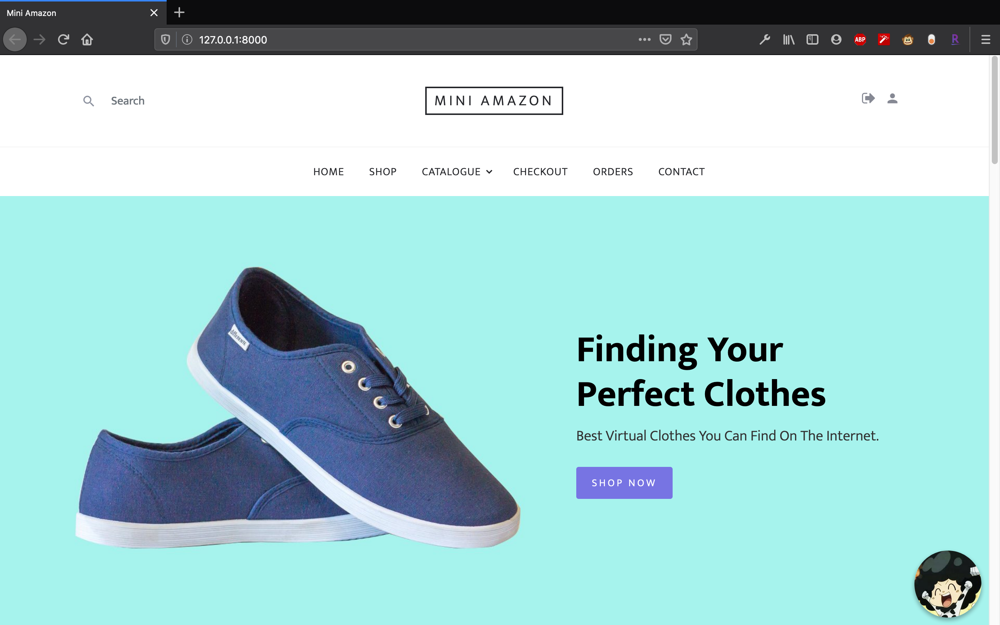
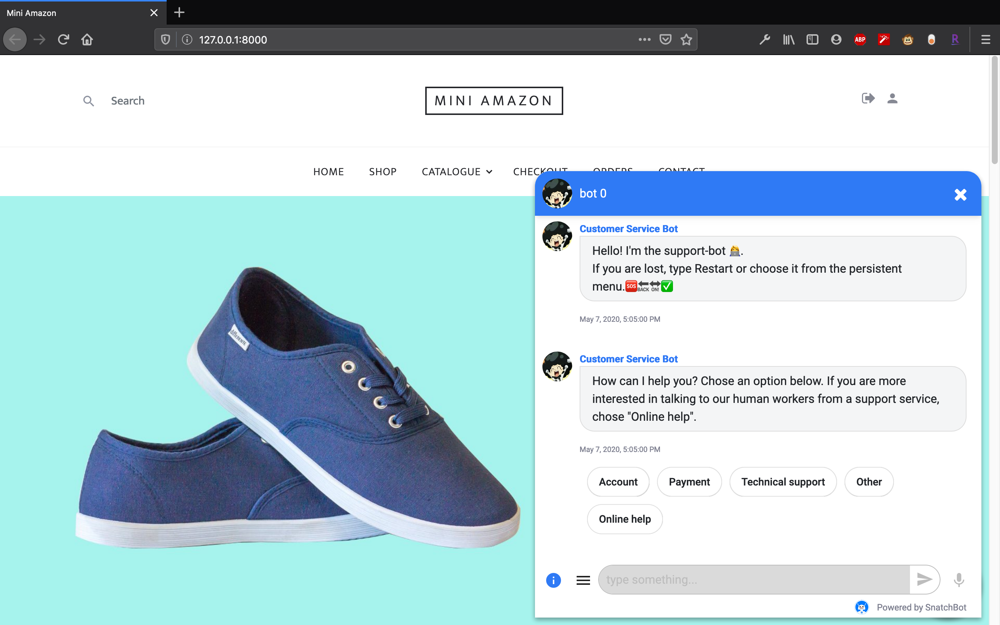
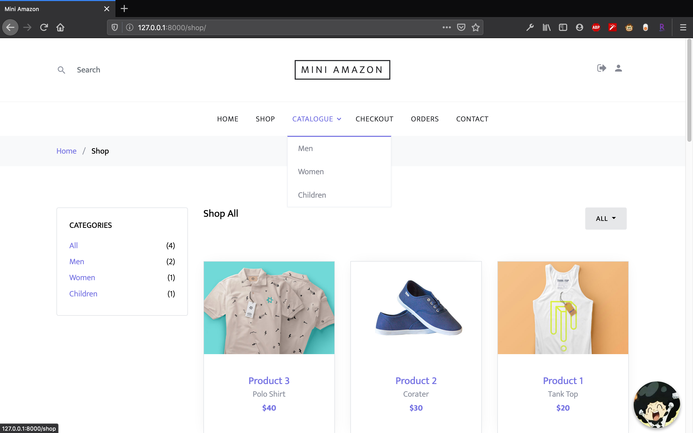

# Amazon

Django based mini-amazon

grade: 98/100

## preview

homepage:



chatbot:



catalog:



[requirements](http://people.duke.edu/~bmr23/ece568/homework/project/project.pdf)

[IG](https://docs.google.com/spreadsheets/d/1xB1kVaa4TljtqrMqvqrEJRorB4UoOLBfGVfavlrrDxY/edit#gid=0)

## suggestions

### frontend

find good bootstrap template, then your website is more attractive

## backend

good use of OOD can make backend code more elegant

3 ways to implement backend:

1: server is seperate from frontend, communicate through database

2: declare server as global in views.py

```python
global back
back = Back()
```

3: server as local variable.

Every time when frontend needs backend, just create new connection

## [world](https://github.com/yunjingliu96/world_simulator_exec)

## [proto](https://docs.google.com/document/d/1nDxoA-c2WotzFlN2hpPhzbN9eMS5ylgcCMo8DW-Btp4/edit?usp=sharing)

## port

world(amazon) : 23456

group1: 33333
